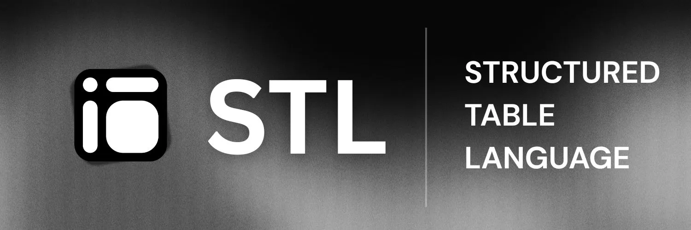

# Structured Table Project 🛠️



> **Structured, themeable, SSR-friendly tables for React and modern web applications.**

This project has been evolved into a **Monorepo** powered by [Turbo](https://turbo.build/) and [pnpm](https://pnpm.io/), separating core logic, CLI tooling, and documentation for better scalability and maintenance.

---

## 🏗️ Why Monorepo?

The shift from a monolithic structure to a pnpm-powered monorepo was driven by several key benefits:

- **⚡ Real-time Package Syncing**: Using pnpm workspaces, changes made to the core engine (`packages/structured-table`) or the CLI are immediately available in the documentation app (`apps/web`) without needing to publish or manually link packages. This provides a seamless feedback loop during development.
- **🧪 Integrated Testing**: We can run tests and lint checks across all packages and apps simultaneously using TurboRepo's parallel execution, ensuring that changes in the core library don't break the CLI or the web implementation.
- **📦 Unified Dependency Management**: Single lockfile for the entire project reduces "dependency hell" and ensures consistent versions of tools like TypeScript and ESLint across the whole codebase.
- **🚀 Optimized CI/CD**: Turbo's remote caching and task orchestration mean we only build and test what has changed, drastically reducing build times as the project grows.

---

## 🏗️ Monorepo Architecture

The repository is organized into distinct workspaces to separate concerns:

### 📦 Packages (`/packages`)

- **[`structured-table`](./packages/structured-table)**: The core headless engine. Handles data parsing, state management, and STL (Structured Table Language) logic.
- **[`structured-table-cli`](./packages/structured-table-cli)**: The developer's toolkit. Used to scaffold renderers and components directly into your apps (e.g., `npx stl-cli add react`).

### 🚀 Applications (`/apps`)

- **[`web`](./apps/web)**: The official documentation site, playground, and showcase built with Next.js 16 (App Router).

---

## 🚀 Getting Started

### Prerequisites

- [Node.js](https://nodejs.org/) (v20+ recommended)
- [pnpm](https://pnpm.io/) (v10+ recommended)

### Installation

Clone the repository and install dependencies from the root:

```bash
pnpm install
```

### Development

Run all packages and apps in development mode:

```bash
pnpm dev
```

To run a specific workspace (e.g., just the web docs):

```bash
pnpm dev --filter web
```

### Building

Build all packages and apps:

```bash
pnpm build
```

---

## ✨ Key Features

- **🧩 Headless Architecture**: Decoupled logic gives you 100% control over the UI.
- **🚀 CLI-Driven Scaffold**: Own your components. Scaffold renderers into your `src/components` with one command.
- **⚡ SSR & React Server Components**: Native support for Next.js App Router and high-performance rendering.
- **🎨 Themeable**: Zero-config compatibility with Tailwind CSS, CSS Modules, or Vanilla CSS.
- **🔌 CMS Native**: Built-in specialized support for **Sanity** table data structures.

---

## 🛠️ Usage (For End Users)

1. **Install Core**:

   ```bash
   npm install structured-table
   ```

2. **Add Renderer**:

   ```bash
   npx stl-cli add react
   ```

3. **Render Table**:

   ```tsx
   import { TableView } from "@/components/stl-render-react/latest";

   export default function Page() {
     return <TableView data={stlData} />;
   }
   ```

---

## 📄 License

MIT © [Yashraj Yadav](https://github.com/ameghcoder)
